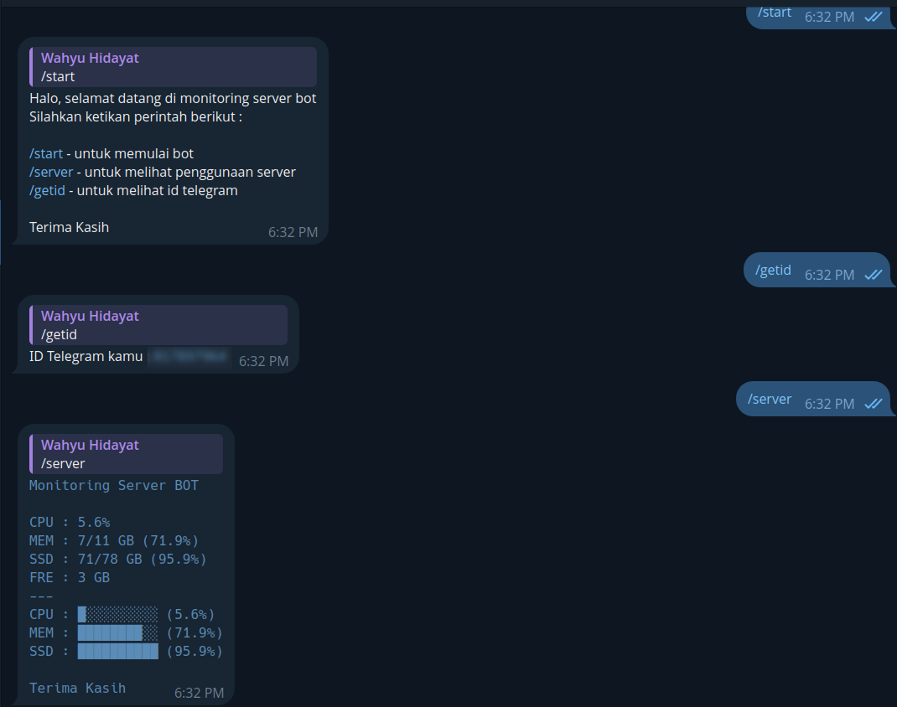

# Monitoring Server Bot

This is a simple Telegram BOT for monitoring resource server in Linux
Basic function :
/start - start the bot
/server - monitoring the server (CPU Usage, RAM Usage and Storage Usage)
/getid - print your unique ID telegram

## usage :
> Open terminal and type
```
pip install telebot psutil
python bot.py
```

## Preview

